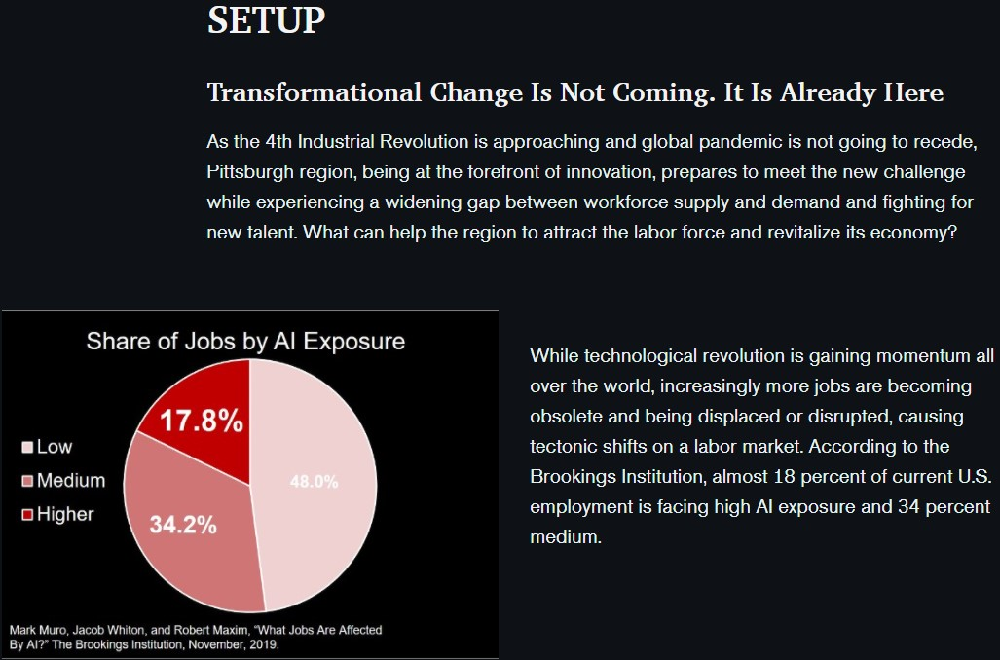
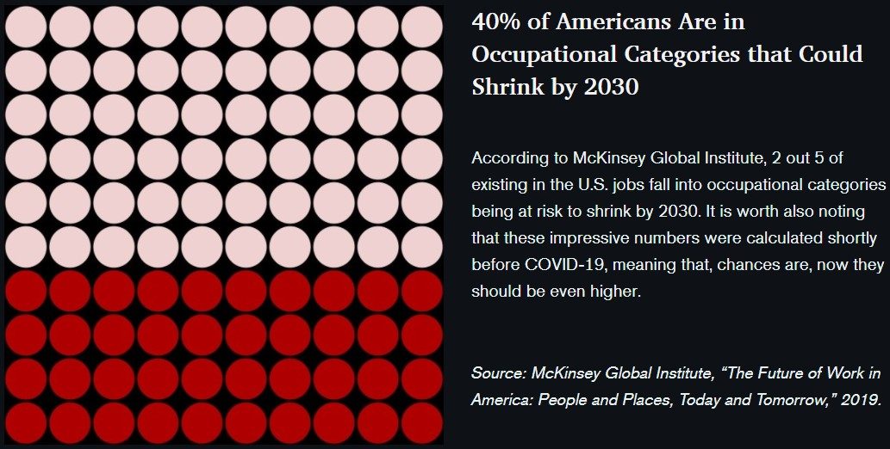
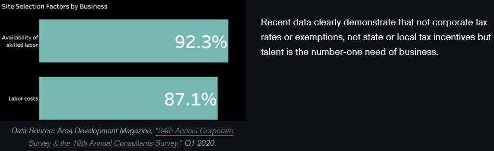
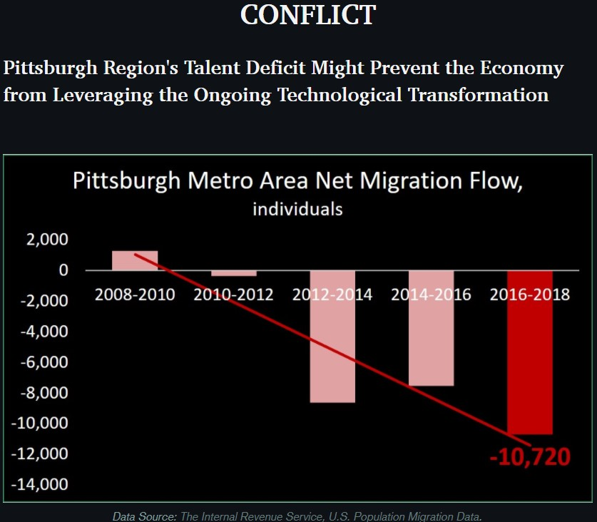
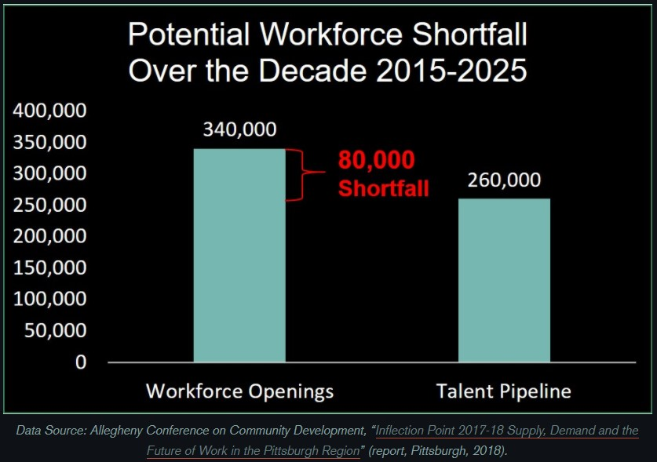
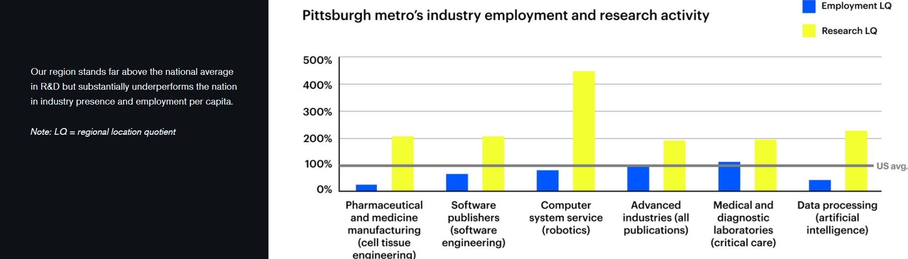
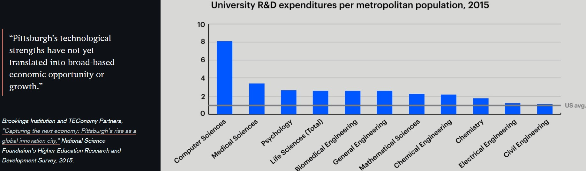
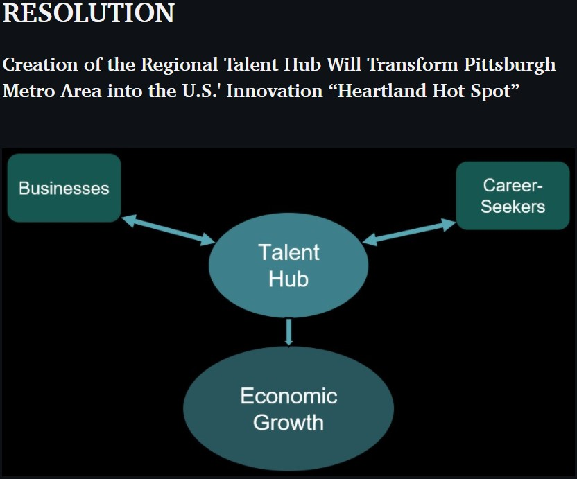
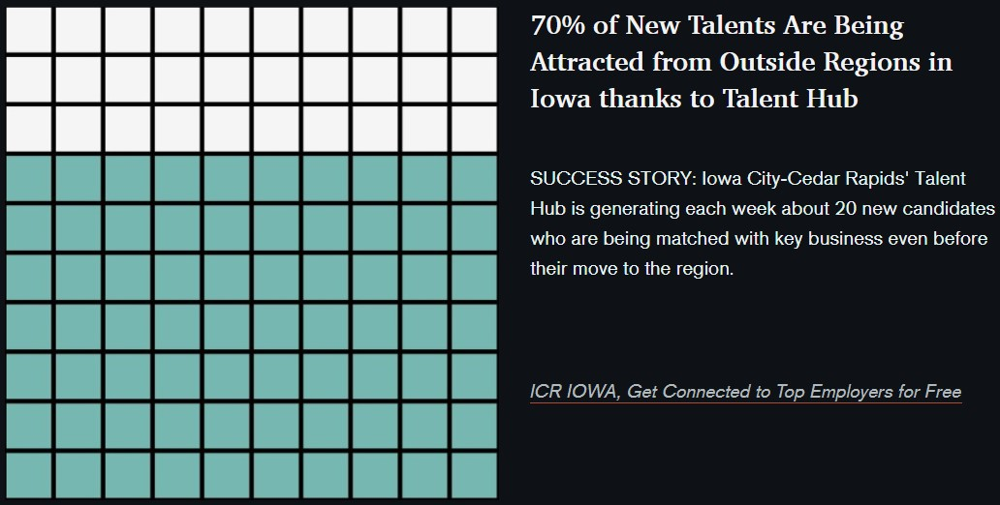

[LINK TO PART 1](/FinalProjectPart_I_AnnaKolesnikova.md)
# PART 2
## WIREFRAMES AND STORYBOARDS
I decided to use as the base for my storyboard the one I drew for Part 1 (see link above). To make it more easy-to-understand, I recreated the charts in Tableau, Excel, and PowerPoint.
Once I'd spent many hours trying to educate myself on how to build different types of dataviz in Tableau, I was terribly happy to discover that ArcGIS Pro StoryMaps do not
embed interactive charts from this program. It says,
> *This content isn't supported. The web content you've added
> does not support live embedding. / This website does not support inline embedding.*

But this did not stop me and I decided to make selection screen captures instead. While with Flourish everything worked well.
 
Those draft versions of my graphics from Tableau and Excel I added to the StoryMaps and worked there since then.
 
 
[Here is the link to my Online Story](https://arcg.is/0aPCqL0)
 
 
At the end of this page, are presented screenshots from the same story (its draft version) for better convenience.

## USER RESEARCH AND INTERVIEWS
### INTERVIEWEES
Since my main target audience is the labor-related government as was described in Part I and since it would be unrealistic for me to reach out to real policy-makers
from there at this point, I was searching for those individuals who are not only highly conversant with the discussing issues and are cognizant of the ongoing changes
in our region’s economy and labor market, but also who have strong connections with the government and possess a variety of tools and capabilities for advocating for
the proposed regional policies and mobilizing leadership forces.
 
 
Of course, the best and single candidate for this is the [Allegheny Conference on Community Development (ACCD)](https://www.alleghenyconference.org/). All my three interviewees are/have been working for this influential at the South-Western Pennsylvania scale organization and all of them I know in person. I would describe the first one a *“Big Boss,”* the second – *“Right-Hand of BB,”* and the third – *“My CMU Fellow and Former Companion at ACCD.”*
### PROTOCOL
#### INTRODUCTION
“First, thank you for taking time to have a chat with me today. My goal is to get to know your observations on a storyboard that I’ve designed for my project on a theme
I am passionate about. Your feedback will remain anonymous, and our talk would take less than 10 minutes. There are no right or wrong answers, any your thoughts and
comments would be greatly appreciated.”
#### MAIN TALK
“Once you’ve got acquainted with the storyboard, I ask you just five brief questions. You do not need to go deep into profound and detailed answers.
Your first impression would be the most valuable since the target audience of this project will not have more than two minutes to figure out what I am going to deliver
for them.”
 
 
**Questions**
1. Did you get what is the problem? If yes, what is this and do you find it urgent?
2. Is it clear enough what the proposed solution is? Would you support it?
3. Is something here you want to learn more about?
4. Did you find something confusing?
5. What would you recommend improving?
<a/>

#### WRAP-UP

“Thank you very much for your time and your feedback. Should you have any follow-up questions please feel free to reach out to me at akolesni@andrew.cmu.edu.”

### FINDINGS FROM THE CONVERSATIONS

#### 1. Big Boss (BB)
First of all, I want to say that It’s been a true miracle to have a chance to talk to her this week given her extreme busyness and tight schedule.
We had been planning to have a meeting for weeks but because of ongoing craziness around it was really hard to find a time convenient for both of us.
Luckily, when we finally managed to arrange a call, this time coincided with the second week of working on the Final project at the Telling Stories with Data class
and I was able to ask BB relevant to it questions.
 
 
What I’ve learned from her, is that I should be more focused on particular actions that I am going to present to the defined audience.
She confirmed that she understood the problem and my call to action but from her perspective, it would be better if I concentrated on a more precise description
of the necessary steps to take. So, the key takeaway for me from our conversation was to add clarifying information on the proposed solution.

#### 2. Right-Hand of BB
This interviewee brought to my attention a couple of details of my storyboard that requires more elaboration. For example, pertaining to the fourth question and the first chart, she said:
> Will you explain this chart? It isn't super obvious.

I took this comment as definite evidence that it is not clear why I am citing these numbers in the first place because on this Thursday’s class,
I received exatly the **same** comment from one of my fellows during the break-out session!
 
 
Answering the third question, she noted with respect to the fifth sketch about business:
> Great data points - be prepared to answer questions about these as they're super interesting!

I will certainly leave this chart for the final version of my story.
 
 
Regarding the other script questions (about the recommendation and suggested proposal), my interviewee replied back with questions:
> So basically a "Talent Hub" is what you're proposing Pittsburgh does in order to address this need, correct? Be prepared to talk about what exactly this is - how exactly is this different than ACCD, Partner4Work, other orgs?

That was a clear sign that my resolution part is a weak spot in my presentation, and I should work more on it.
#### 3. My CMU Fellow and Former Companion at ACCD
##### Direct answers:
1. Yes, it's clear. Pittsburgh faces a shortfall of talent which is key for business growth here, and the problem is likely to get even worse. The numbers are so stark that I do find the problem urgent.
2. I understand the talent hub section (bottom left) but I'm a little confused about outside-region talent (bottom right): is it currently at 70% or you're proposing increasing it to 70%? I definitely support the talent hub thing.
3. Maybe a few short bullet points about what the talent hub would do. But not a big deal.
4. I'm not sure what "shrink" means on the top right. Like is a 40% reduction in the # of U.S. jobs projected? Or are 40% of occupations at risk? I'm unclear on that.
5. I would maybe change 'Setup' to 'Context'. I think that covers it. It looks great. I hope you send over the final product!

Clearly, responses from my fellow are pretty much similar to the previous two ones. The beginning of my storyboard and its end have definitely something to be improved. I believe more message-like titles and subtitles and slight graphic modifications will mitigate the overall confusion.

### CONCLUSIONS
It is fascinating how different people can make similar notes. Given the received invaluable feedback, I will definitely modify the first and last stages of my story.
And it was not surprising for me that no one from my interviewees asked clarifications about the middle part since all of them are well familiar with the situation and
do not need specific details. But all three expressed interest in the impending “AI-threat” and in the proposed final idea on how exactly to combat the existing challenges.
 
 
These apparent commonalities in the answers made me rethink my approach for presenting the first two charts (I will change the title and add a subtitle so that to establish a connection between the purpose of my story and these data) and supplement the call-to-action figure with more details which I’ll lay out maybe as a schematic text on a next picture.
 
 
#### Promised Screenshots

 
 

[Return to Part I](/FinalProjectPart_I_AnnaKolesnikova.md)

[Go to Part III](/FinalProjectPart_III_AnnaKolesnikova.md)

[Back to Main Portfolio Page](/README.md)
