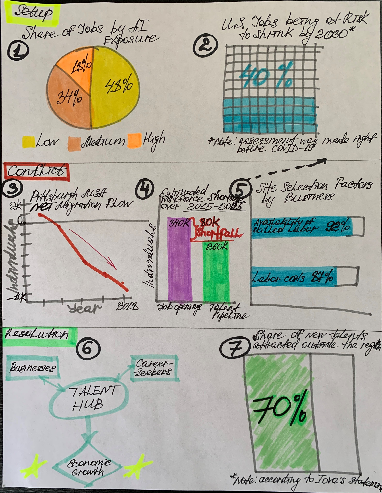

# PART 1
## OUTLINE
### Project Name
Talent Rise & Business Attraction in the Pittsburgh region
 
*amid the pandemic while on the eve of Industry 4.0*
### Summary of the Project
As the 4th Industrial Revolution is approaching and global pandemic is not going to recede, Pittsburgh region, being at the forefront of innovation,
prepares to meet the new challenge while experiencing a widening gap between workforce supply and demand and fighting for new talent.
What can help the region to attract the labor force and revitalize its economy?
### Final Goal of the Story
Urge Pennsylvania Department of Labor to establish Pittsburgh Talent Hub and bring together businesses, job-seekers, education providers, non-profits,
and workforce development boards.
 
### Project Structure
**Setup:** Transformational change is gaining momentum all over the world. Increasingly more jobs are becoming obsolete and being displaced or disrupted,
causing tectonic shifts on a labor market.
 
 
**Conflict:** Despite the Pittsburgh region is well-armed with technology and its Research & Development capabilities,
it has a large talent deficit that might prevent its economy from leveraging the ongoing technological transformation.
 
 
**Resolution:** Creation of the regional Talent Hub will not only mitigate the effect of the COVID-19 crisis on the economy
but also make the Pittsburgh metro area one of the most flourishing “Innovation Center” in the nation.
 
### User Story
As a reader (a member of a local government – PA Department of Labor & Industry's Workforce Development), I want my region raise and attract skilled workforce
so that overcome the difficulties of current technological change and make the economy flourish.
 
 
I can do this by exploring successful examples of relevant programs from other states and creating the Talent Hub entity which will make Pennsylvania,
and Pittsburgh region in particular, “Heartland Hot Spot.”
## SKETCHES

I would also include a couple of sketches displaying Pittsburgh MSA strengths and advantages as described for the second part of the story but I thought it would be redundant here because I am going to use the infographics directly from the Brookings Institution's report (see source below) since I do not have access to the original data.
## DATA
Since I am going to bring to the reader’s attention the significant outflow of economically active population from the Pittsburgh Metropolitan Statistical Area (MSA),
I will need the raw data directly from [Internal Revenue Service](https://www.irs.gov/statistics/soi-tax-stats-migration-data). Their website contains last available data
on migration flows across the years among the Unites States, including its counties. 
 
 
While volunteering for the Allegheny Conference on Community Development (ACCD) last year (and doing my internship there this summer),
I learned that Pittsburgh MSA consists of seven counties: Allegheny, Armstrong, Beaver, Butler, Fayette, Washington, and Westmoreland.
For each of them, it is possible to compute the net migration flow: calculate the difference in a number of residents who left the county and who moved into it,
and then to sum everything up.
 
 
Also, I am going to use statistics from other resources such as:
 
 
[ACCD’s famous Inflection Point report](https://www.alleghenyconference.org/wp-content/uploads/2016/08/InflectionPoint.pdf)
 
I will get from there numbers of talent shortfall.
 
 
[Area Development Magazine’s 34th Annual Corporate Survey & the 16th Annual Consultants Survey](https://www.areadevelopment.com/Corporate-Consultants-Survey-Results/Q1-2020/34th-annual-corporate-survey-16th-annual-consultants-survey.shtml)
 
From here, I will borrow information pertaining to the businesses’ labor-related preferences.
 
 
[McKinsey Global Institute’s “The Future of Work in America: People and Places, Today and Tomorrow” report](https://www.mckinsey.com/~/media/McKinsey/Industries/Public%20and%20Social%20Sector/Our%20Insights/Future%20of%20Organizations/The%20future%20of%20work%20in%20America%20People%20and%20places%20today%20and%20tomorrow/The-Future-of-Work-in-America-Full-Report.pdf)
 
This paper will provide me levels of risk for Americans of being soon unemployed (more tension!).
 
 
[Brookings Institution’s “What Jobs Are Affected By AI?” study](https://www.brookings.edu/wp-content/uploads/2019/11/2019.11.20_BrookingsMetro_What-jobs-are-affected-by-AI_Report_Muro-Whiton-Maxim.pdf)
 
It contains interesting for me numbers of shares of jobs exposed to AI (this will help create tension in my story-telling).
 
 
[Brookings Institution and TEConomy Partners’ analysis “Capturing the next economy: Pittsburgh's rise as a global innovation city”](https://www.brookings.edu/wp-content/uploads/2017/09/pittsburgh_full.pdf)
 
I will derive from this study contrasting numbers regarding the Pittsburgh region’s R&D capacity and its economic activity/employment.
 
 
[Brookings Institution’s research “The Case for Growth Centers”](https://www.brookings.edu/wp-content/uploads/2019/12/Full-Report-Growth-Centers_PDF_BrookingsMetro-BassCenter-ITIF.pdf)
 
Not sure yet if I am going to use this one due to the lack of presentation time but I will definitely quote them in their lovely naming of the Pittsburgh metro area
(“Growth Center,” “Innovation Center,” “Heartland Hot Spot,” “Advanced Industry Hub,” “Top Innovation Hub,” etc.).
 
 
and many others more as sites for getting examples of successful experience of implementing proposed programs.
## METHOD AND MEDIUM
I am going to build my story through [Esri's Story Maps](https://storymaps.arcgis.com/) that will allow me to nicely organize the material and create separate blocks for each part of the story.
Also, this tool will enable publishing both interactive charts and static pictures.
 
 
Since my entire story would be devoted only to the Pittsburgh region as one entity, I do not see any reason to create spatial maps.
But I will do use sidecar blocks so that it would be convenient for a reader to visually connect dataviz to the corresponding text.
 
 
For crunching numbers, I am going to use of course Excel and for drawing graphs mainly [Tableau](https://www.tableau.com/) and occasionally [Flourish](https://flourish.studio/).
If I decide to create infographics transmitting some specific conceptual ideas, probably I will build it in Microsoft PowerPoint.
 
 
In terms of mood images, I decided to use [Getty Images platform](https://www.gettyimages.com/) providing the embed feature option.
 
Links to some examples of pictures I like: [3D hologram of city](https://www.gettyimages.com/detail/photo/hologram-of-city-royalty-free-image/674826784), 
[Artificial Intelligence Automobile](https://www.gettyimages.com/detail/photo/artificial-intelligence-automobile-royalty-free-image/1128738858), 
[Mature woman working by 3d printer](https://www.gettyimages.com/detail/photo/mature-woman-working-by-3d-printer-royalty-free-image/503895750).
 
 
Yes, they are all performed mostly in cyan-ish color since I believe that it goes well with such terms as *AI*, *Future*, *Opportunities*, and other inspiring ideas flying in the sky. 
 
 

[Back to Main Portfolio Page](/README.md)
