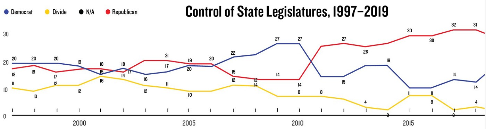
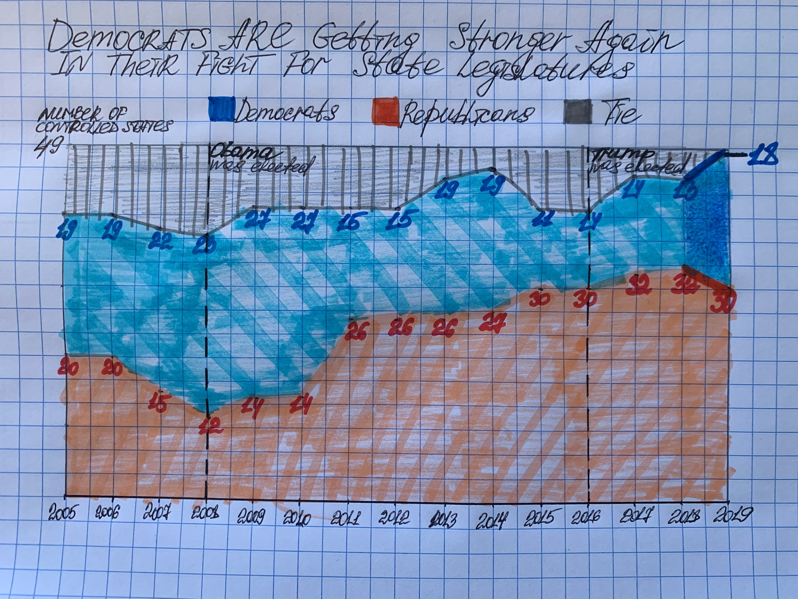

## INTRODUCTION
As the 2020 U.S. Presidential election is coming closer, increasingly more people are becoming involved in the corresponding informational field, including me.
Being a permanent resident of the U.S. and studying public policy, I am more than simply interested in this topic. I am highly concerned about it.
That is why I searched for some actual statistics on the states' political affiliation. Eventually, I came across the following The Nation magazine's article: [Democrats Are Winning Their Fight for the States](https://www.thenation.com/article/politics/democrats-elections-statehouses/)
 
 
It made me curious and I dived into the reading. But before I discuss my findings, I feel I need first to share my impression of what I read.
As a Russian, I am all hands for true democracy but this article made me really angry.
Based on this piece of writing, I found The Nation magazine egregiously left-biased media.
I have never read them before and will never do after this extremely unpleasant experience.
It is absolutely fascinating how they manipulate statistics, twist facts, distort information, and misinterpret data. It’s been utterly abhorrent to me.
That’s enough for emotions, let’s go to constructive data visualization critique.
 
 

## DISCUSSION
In the article, The Nation even did not make a slight effort to show visual evidence to convince their readers of what they are trying to prove.
In fact, their chart that I am presenting below demonstrates the situation exactly opposite to the described one,
which plays directly against their logic embedded in the article's title:
 
 

*Source: National Conference of State Legislatures*
 
 

As I have written in my critique part of the assignment, this chart clearly demonstrates that Democrats had been *losing* their fight for the states,
not *winning* till the last year. But this "last year" comprises no more than 5% of the whole graph and is not even indicated.
 
Just imagine: all this looong article is devoted only to the tiny-pitiful piece of space close to the right edge that readers must define somehow intuitively by themselves!
Moreover, the entire narrative is playing around total numbers (including even the subtitle of the article), referring to the whole, complex picture of legislative seats, but it is not reflected on the chart.
Therefore, it was pretty easy for me to choose the right type of chart to show the combined graphs - Stacked Area chart.
 
 
But that was just the beginning of the process. Having finished Stephen Few's critique method assignment,
I realized that there will be much work to make this chart more meaningful. To do this effectively, I decided to pretend The Nation's passionate reader and to play
devil's advocate so that to help them effectively translate what they intended to.
 
 
Main insights that I received from the critique exercise:

**Usefulness.** Clearly, the dataviz is of zero value to the audience. What is worse, it creates confusion to the reader.

**Completeness.** The amount of presented information is not adequate: too much extra unneeded data.

**Perceptibility.** Definitely, the graph does not display information effectively.

**Truthfulness.** As Stephen Few states, validity as an integral element of truthfulness indicates how well something represents what it claims.
Undoubtedly, this is the worst part of our case.

These observations and also those that I described in detail in my critique assignment led me to actual sketching.
 
 

## SKETCHING
Drawing this sketch, I did my best to reflect everything I mentioned in 10 steps for improvement in the critique assignment.
 
 

 
 

## GETTING FEEDBACK
Having finished this masterpiece, I asked my husband (in person) and brother (via WhatsApp) for their feedback. Given that the latter does not know the English language at all, his thoughts were especially valuable since he based his inferences solely on general perceptions, not bothering to dig deep into the story details. :) He said that he does not like data labels because they blend in with the background, and the same effect have labels with presidents' names for two dashed reference lines. His notes prompted me to change my mind with regard to labeling data points, specifically about their color. Also, he added that "something must have been going for the last year." Bingo! 
 
 
As for my husband, he is also extremely interested in the theme of the presidential election as I am, so he did not need any explanations for my drawings. To my relief, he even made some relevant comments that assured me that he correctly understood the message of the chart. A single note he made was related to the name of Y-axis. From my husband's perspective, its placement is not clear enough; it took several seconds for him to find it. It was hard not to agree with him on this point as Y-axis title indeed mingles with the legend, with the "49"-label, and partly with the chart's title. So, it convinced me to move it for a better place for my final solution.
 
 

## FINAL CREATION
Despite it was not too difficult to recreate the data from the picture, I decided to use more recent data from the online data-resource
[Statista](https://www.statista.com/statistics/198497/distribution-of-political-party-control-of-us-state-legislatures-since-1990/).
 
I had trouble with access to their data through my laptop (because I do not have a paid account there) but it magically worked through my phone.
So, my next steps were just to copy and paste numbers to the Excel sheet, insert it to the Tableau worksheet, and implement suggestions from my two recommendation-givers.
 
 

<noscript></noscript><object class='tableauViz'  style='display:none;'><param name='host_url' value='https%3A%2F%2Fpublic.tableau.com%2F' /> <param name='embed_code_version' value='3' /> <param name='site_root' value='' /><param name='name' value='3-4_16005317450800&#47;Dashboard1' /><param name='tabs' value='no' /><param name='toolbar' value='yes' /><param name='static_image' value='https:&#47;&#47;public.tableau.com&#47;static&#47;images&#47;3-&#47;3-4_16005317450800&#47;Dashboard1&#47;1.png' /> <param name='animate_transition' value='yes' /><param name='display_static_image' value='yes' /><param name='display_spinner' value='yes' /><param name='display_overlay' value='yes' /><param name='display_count' value='yes' /><param name='language' value='en' /><param name='filter' value='publish=yes' /></object>

*Source: National Conference of State Legislatures*
 
 

As can be seen from this new version of the chart, the situation unfolding in 2019 clearly draws attention and helps a reader focus first on the most recent data and then compare it to the rest of the data series. This time, the audience can follow the dynamics of how much of the **total** number of states had been making up each party throughout the years. Now, it can be instantly noticed that in 2019, Democrats started to regain their legislatures seats that directly speaks to the article's narrative, even adding some inspiration.

Also, the chart is cleaned of unnecessary information, helping to convey the message that is supposed to convey. If I had seen something similar when I read this article first time, I would have reacted to it completely differently, since it would have appeared to be quite reasonable, consistent, and logical.
 
 

[Back to Main Portfolio Page](/README.md)
